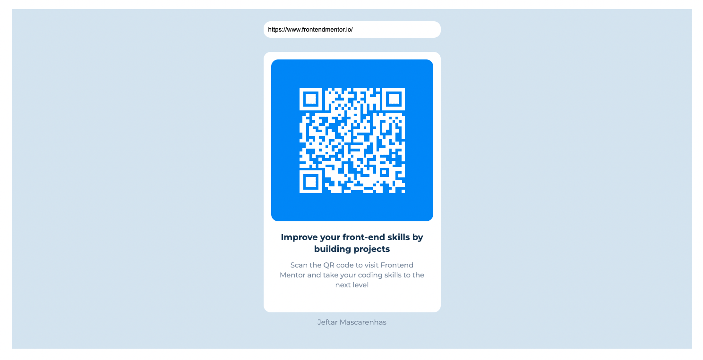

# Frontend Mentor - QR code component solution

This is a solution to the [QR code component challenge on Frontend Mentor](https://www.frontendmentor.io/challenges/qr-code-component-iux_sIO_H). Frontend Mentor challenges help you improve your coding skills by building realistic projects.

## Table of contents

- [Overview](#overview)
  - [Screenshot](#screenshot)
  - [Links](#links)
- [My process](#my-process)
  - [Built with](#built-with)
  - [What I learned](#what-i-learned)
  - [Author](#author)

**Note: Delete this note and update the table of contents based on what sections you keep.**

## Overview

I did this component only with html, css and JS. I could do the component with React, but in this case
I wanted to remember of core web technologies.

### Screenshot



Add a screenshot of your solution. The easiest way to do this is to use Firefox to view your project, right-click the page and select "Take a Screenshot". You can choose either a full-height screenshot or a cropped one based on how long the page is. If it's very long, it might be best to crop it.

Alternatively, you can use a tool like [FireShot](https://getfireshot.com/) to take the screenshot. FireShot has a free option, so you don't need to purchase it.

Then crop/optimize/edit your image however you like, add it to your project, and update the file path in the image above.

**Note: Delete this note and the paragraphs above when you add your screenshot. If you prefer not to add a screenshot, feel free to remove this entire section.**

### Links

- Solution URL: [Add solution URL here](https://github.com/jeftarmascarenhas/30-days-30-projects.github.io/tree/main/qr-code-component-main)
- Live Site URL: [Add live site URL here](https://jeftarmascarenhas.github.io/30-days-30-projects.github.io/qr-code-component-main/index.html)

## My process

### Built with

- CSS custom properties
- Flexbox
- Mobile-first workflow
- QR Code lib

**Note: These are just examples. Delete this note and replace the list above with your own choices**

### What I learned

This challenge it's for me to remember HTML, CSS and JS without Libs or Framework. Excerpt when did QR Code generate.

```html
<section class="container">
  <form class="qrcode-form" id="qrcode-generate">
    <input
      type="text"
      class="input-control --border-radius-small"
      placeholder="Generate QR Code"
      name="qrcode-input"
      id="qrcode-input"
    />
  </form>
  <div class="qrcode-wrap --border-radius-small">
    <div class="qrcode-header --border-radius-small">
      <div class="qrcode-img" id="qrcode"></div>
    </div>
    <div class="qrcode-body">
      <h2 class="qrcode-title">
        Improve your front-end skills by building projects
      </h2>
      <p>
        Scan the QR code to visit Frontend Mentor and take your coding skills to
        the next level
      </p>
    </div>
  </div>
  <p>Jeftar Mascarenhas</p>
</section>
```

```css
* {
  box-sizing: border-box;
  padding: 0;
  margin: 0;
}

:root {
  --white: hsl(0, 0%, 100%);
  --light-gray: hsl(212, 45%, 89%);
  --grayish-blue: hsl(220, 15%, 55%);
  --dark-blue: hsl(218, 44%, 22%);
  --dodger-blue: hsl(222, 96%, 63%, 1);
}

section {
  display: block;
}

h1 {
  font-weight: 700;
}

p {
  font-size: 1.5rem;
  font-weight: 400;
  margin: 1rem 0;
  color: var(--grayish-blue);
}

img {
  width: 100%;
  display: block;
  height: auto;
}

input {
  outline: none;
}

html,
body {
  font-size: 10px;
  width: 100%;
  height: 100%;
}

body {
  font-size: 1rem;
  font-family: "Montserrat", sans-serif;
  background-color: var(--white);
  display: flex;
  align-items: stretch;
  justify-content: center;
  line-height: 1.4;
}

.--border-radius-small {
  border-radius: 1.5rem;
}

.qrcode-form {
  margin-bottom: 3rem;
  display: flex;
  align-items: stretch;
  width: 100%;
  max-width: 375px;
}

.input-control {
  display: block;
  width: 100%;
  border: 0;
  padding: 1rem;
}

.container {
  background-color: var(--light-gray);
  width: 100%;
  height: 100%;
  display: flex;
  flex-direction: column;
  align-items: center;
  padding: 2.6rem;
}

.qrcode-wrap {
  max-width: 375px;
  background-color: var(--white);
  padding: 1.6rem;
}

.qrcode-header {
  background-color: var(--dodger-blue);
  padding: 6rem;
  display: flex;
  align-items: center;
  justify-content: center;
}

.qrcode-body {
  padding: 2.2rem 1.5rem;
  text-align: center;
}

.qrcode-body > p {
  text-align: center;
}

.qrcode-title {
  color: var(--dark-blue);
  font-size: 1.8rem;
  font-weight: 700;
}

.qrcode-img {
  /* min-width: 10rem; */
}

@media screen and (min-width: 1024px) {
  body {
    padding: 4rem;
  }
}
@media screen and (min-width: 1025px) {
  .container {
    max-width: 1440px;
  }
}
```

```js
((win, doc) => {
  const onLoad = () => {
    const qrCodeGenerate = doc.getElementById("qrcode-generate");
    const qrCodeInput = doc.getElementById("qrcode-input");

    let value = "https://www.frontendmentor.io/";
    qrCodeInput.value = value;

    const qrcode = new QRCode("qrcode", {
      colorDark: "#fff",
      colorLight: "transparent",
    });

    const makeQrCode = () => {
      qrcode.makeCode(value);
    };

    makeQrCode();

    const formSubmit = (event) => {
      event.preventDefault();
      if (!value) {
        alert("Empty input");
        return;
      }
      makeQrCode();
    };

    const inputChange = (event) => {
      value = event.target.value;
    };

    qrCodeGenerate.addEventListener("submit", formSubmit);
    qrCodeInput.addEventListener("keyup", inputChange);
  };

  win.addEventListener("load", onLoad);
})(window, document);
```

## Author

- Website - [Jeftar](https://jeftar.com.br)
- Frontend Mentor - [@jeftarmascarenhas](https://www.frontendmentor.io/profile/jeftarmascarenhas)
- Twitter - [@jeftar](https://www.twitter.com/jeftar)
